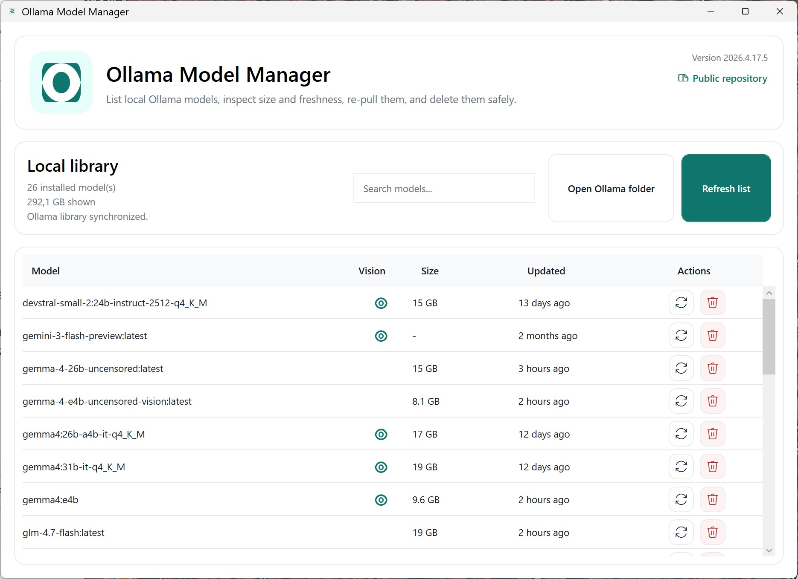

# Ollama Model Manager by ObviousIdea

[](https://github.com/obviousidea/ollama-model-manager-by-obviousidea/releases)


A Windows desktop app to inspect, refresh, and clean up local Ollama models without going back to the terminal.



## Why this app

Ollama Model Manager gives you a fast local view of your installed models, their size, freshness, and capabilities, with safe cleanup actions in a simple desktop UI.

It is designed for people who use Ollama heavily and want a cleaner way to see what is installed, identify large models, spot vision-ready entries, and remove what they no longer need.

## Highlights

- Clean local library overview for Ollama
- Vision-capable model detection from Ollama capabilities
- One-click re-pull for outdated or broken local models
- Safe delete flow with confirmation
- Native Windows desktop experience with automatic light and dark theme support

## Features

- List installed local Ollama models
- Show model size and last update freshness
- Detect vision-capable models from Ollama capabilities
- Re-pull a model directly from the UI
- Delete a model with confirmation
- Filter the local library with search
- Follow the Windows light or dark theme automatically

## Installation

Download the latest installer from the GitHub Releases page and run it on Windows:

- [Latest release](https://github.com/obviousidea/ollama-model-manager-by-obviousidea/releases)

The release currently ships as a standalone installer, so no separate .NET runtime installation is required.

## Requirements

- Windows
- Ollama installed locally

## How it works

The app uses the local Ollama CLI and API to read your installed model list, inspect capabilities such as `vision`, re-pull models, and remove them safely from your local machine.

## Tech stack

- WPF
- .NET 10
- Inno Setup for the installer

## Build

```powershell
dotnet build
```

## Publish standalone binary

```powershell
dotnet publish -c Release
```

## Installer

The repository includes an Inno Setup script for packaging:

```text
installer.iss
```
